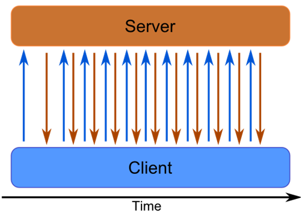
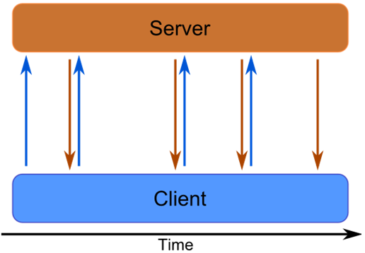
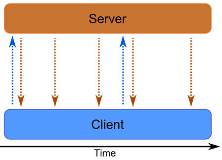
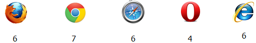

Cometes is a Latin word with meaning "wearing long hair". Aristoteles used it for description of stars with the long hair, for comets.

> Comet is the collection of techniques based on HTTP, for processing of long living connections.

Let’s introduce a typical comet application - chat. As a client, you post messages and expect responses as other users respond - in the real-time. You want see whether user is typing a message and his status (online, offline).

Comet is responsible for transfer - from client to server and from server to clients. In most cases single long living connection is established to server and when event occur a message is sent back and the connection is closed. Client then immediately establishes new connection. This way it is possible to emulate client to client communication.

You can find comet inside many popular web applications.

* Gmail uses it for notifications, for chat.
* Facebook for everything :).
* Google Doc for real-time multi user editor.

# First attempts in 1996

Comet is old technology. First time it was introduced in 1996 with Netscape.
This was the first time when these two notions were introduced:

* server push - server is sending messages to clients
* client pull - client is registering for messages

Example request:
```
GET http://www.w3.org/pub/WWW/TheProject.html HTTP/1.1
```

Response:
```
Content-type: multipart/x-mixed-replace;boundary=ThisRandomString

--ThisRandomString
Content-type: text/plain

Data for the first object.

--ThisRandomString
Content-type: text/plain

Data for the second and last object.

--ThisRandomString--
```

Client pulls request from server for some image or html page. As the server pushes response, content of DOM element is replaced with this new value (there can be delays between pushes).

Support in browsers is tragic, only firefox supports it fully.

<figure>
  
  <figcaption>
    Comet browser support.
  </figcaption>
</figure>

## Why Comet was not globally adopted?
Comet was introduced in 1996, but why it was not globally adopted?
The response is simple, there was no demand. Let’s realize what kinds of web applications were modern that time? Simple HTML pages with few images and linked with hyperlinks. Main case for comet was to show image advertisements - it is really only tiny bit of his potential.

## Why it is good time now for real-time?
What has change since 1996? What is the reason for you to consider whether it is time for change? Web application has to show more and more real-time changes, to show graphs, implement chat, browsers notifications, client to client communication. On the other hand you do not want to refresh whole page again and again. This way page can become unusable. The send reason is that browsers now globally support more comet methods and comet is much easier to implement.


# Transport: Polling
<figure>
  
  <figcaption>
    Polling as data transport.
  </figcaption>
</figure>

It is not a real comet technique. (It does not have "long hair" :) ). It simulates real-time interaction by flooding server with sequence of requests. Server immediately responds with message or with no message. However the simplicity of technique is paid by lot of disadvantages:

* It does not scale - with more clients your server will lag. It is unusable with very low number of clients (your DDos your own server ;) )
* It is ineffective - every request has HTTP overhead. In most cases there is no message, nothing is transferred except HTTP headers. In small scale it is negligible, but in large instances it is an issue you should consider.

# Transport: Long-Polling

<figure>
  
  <figcaption>
    Long polling as data transport.
  </figcaption>
</figure>
The difference between polling and long polling are "long hair". Clients pull for messages and server pushes only when some message occurs or connection times out. This is more efficient way of doing comet and it is the most widespread technique, because it works on every browser even thou more fancy methods are avaible.

Problematic is number of clients. When your server holds thread for every request until response, number of clients is limited by maximum of threads that can your server handle simultaneously. This is well known [C10K problem](http://en.wikipedia.org/wiki/C10k_problem). Hopefully this problem was overcame recently in Java with [Servlet 3.0 JSR 315](https://jcp.org/aboutJava/communityprocess/final/jsr315/) specification where request thread can be returned to pool to handle other requests but socket is left open and waiting for event. Response is written from event thread.

# Transport: Streaming

<figure>
  
  <figcaption>
    Streaming as data transport.
  </figcaption>
</figure>

It is like long-polling. But server will push response to the same connection multiple times. Connection is reused for more messages.
It can be done by creating XHR request and registering handler.

```javascript
xmlhttp.onreadystatechange = function() {

  if ( xmlhttp.readyState == 3) { //data has arrived
    //process chunk
  }
}
```

Server will respond with some data structure that can be deserialized. Data may be received by chunks. Program has to demultiplex and fire event to application when whole message is received.

* This does not work in IE :( - IE do not return chunks, only whole message when connection is closed. This can be hacked, but it is more tricky. You can bend IE by sending back JSONP - script tags with JavaScript and JavaScript can be executed on the fly in iframe. You can read more [here](http://meteorserver.org/browser-techniques/) and [here](http://cometdaily.com/2007/11/18/ie-activexhtmlfile-transport-part-ii/).


# Transport: HTML 5 API
Previous techniques were mostly hacks. They bend browsers in a manner they were never meant to be used. From the beginning HTTP was considered to be one way protocol and now we need to make it two way protocol. Preceding solutions works on all browsers but they do not work as we would like. HTML 5 comes with help. It brings JavaScript API to make comet easier to implement.

## API: Event Sourcing
It is [standartized streaming](http://www.html5rocks.com/en/tutorials/eventsource/basics). Client pulls and server pushes messages to the same connection.
```javascript
if (!!window.EventSource) {
  var source = new EventSource('stream.php');
} else {
  // Result to xhr polling :(
}

source.onmessage = function (event) {
  alert(event.data);
};

source.addEventListener('add', function(e) {
  if ( e.readyState == EventSource.CLOSED ) {
    // Connection was closed.
  }
}, false);
```
Browser handles connection - when connection is closed, browser automatically reconnects.

## API: Websockets

<figure>
  
  <figcaption>
    Websockets as data transport.
  </figcaption>
</figure>

After 20 years evolution of web we have finally realized that we need to rediscover what we already had in C for a long time - sockets. There is no extra magic. Client pulls for changes, server parses headers and use TCP connection directly. This connection is bidirectional. It is TCP socket for the web

```javascript
var connection = new WebSocket('ws://go.to/stream');

connection.onopen = function () {
  connection.send('Ping'); // Send the message 'Ping' to the server
};

// Log errors
connection.onerror = function (error) {
  console.log('WebSocket Error ' + error);
};

// Log messages from the server
connection.onmessage = function (e) {
  console.log('Server: ' + e.data);
};
```


> RFC 2616: A single-user client should not maintain more than 2 connections with any server or proxy. 

Every browser has limit how many parallel connections can establish. Therefore comet is often implemented by single connection to the server and all messages are multiplexed to this single connection. If it is used more than limit, request will simply wait until some connection is freed. This can bring unwanted lags.

<figure>
  
  <figcaption>
    Number of paralel connection.
  </figcaption>
</figure>


### Server side
In world of java, comet was properly introduced by Servlet 3.0. It brings the possiblity to make comet without hacks via standart API.
```java
@WebServlet(
  name="myServlet", 
  urlPatterns={"/slowprocess"},
  asyncSupported=true)
public class MyServlet extends HttpServlet {

    public void doGet(HttpServletRequest request, HttpServletResponse response) {
        //store context for later usage
        AsyncContext ctx = request.startAsync(); 
		...
        //you can register connection listener
        ctx.addListener(
        	new AsyncListener() {
            
              public void onComplete(AsyncEvent ae) {}
              public void onTimeout(AsyncEvent ae) {}
              public void onError(AsyncEvent ae) {}
              public void onStartAsync(AsyncEvent ae) {}
              
            }
        );
    }
}
```

API is pretty simple. You mark servlet to support long request (asyncSupported=true). You create AsyncContext from request. You store it somewhere to memory. Method doGet is non-blocking. It finishes properly but socket is still opened. When event occures you pick context and writes response as for usual request.

## Web applications are evolving.
From simple HTML pages to single page applications. Applications became more social, more user friendly, more useful. Comet is a part of paradigm shift that brings web application to the new level even thou HTTP was not designed for it. A lot of people have realized it. Web is no longer static set of CSS and HTML. It is a means how to easily deliver apps to users written on a single platform. It does not matter whether you are using Linux, Windows, Mac, Android, IOs. You can run your apps on all of those systems, written once in JavaScript. Many have tried before but failed: Java Applets, Adobe Flash, Microsoft Silverlight.
To be honest current state of web programming is far from ideal. Making something cross-browser is a pain. Not all browsers supports HTML 5 fully now, but all browsers make effort to fulfill it. This brings less hacking and more focus on business value.