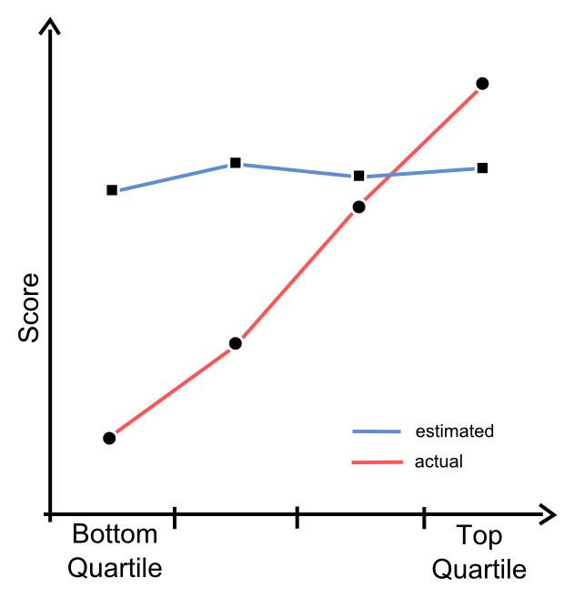

Programming is not entirelly about about coding, design and architecture. A great deal of it is also about people we are working with. I often realize that I struglle more with ego and than with reason, especially when it comes to senior developers with "their ways".

One of a common problems you can anccounter is problem of a screwdriver. You have to attach the schelf with imbus screws, but you do not own propper screw driver. What whould you do? Would you use impropper one ? No, you would go to the shop and obtain propper one. It is logical.

But often you have to deal with something different. You have a bunch of programmers that do not see why you need this different solution when "impropper" screwdriver worked just fine yesterday. You are trying to explain why, but it is not accepted, for many odd reasons, like "I dont belive it will work better". Of course there are many resonable [problems with new technology](http://techblog.netflix.com/2014/11/nodejs-in-flames.html), you have to mitigate risk before. But sometimes problem is not in a technology or bussiness but in people themselves, more precisely in their egos.
You silently say jeeesh, and fight your strugle because you know where it would end other way. You would cripple a screw. And any futre change will be nearly impossible.

If you like your job, you would definitely avoid this even though you would become black sheep. Your main motivation is product itself. You know that any change on diletant design would be costly and drasticall, therefore it is impossible te get rid off it completely. Making change hard is the guaranted path of doom.

> The only constant thing in programming is change.

I have ancountered this "back-pressure" numerous times with TDD, but absolute peak of resistance was reached when I have refused to use "inhouse framework" that was someone else toy, developed for years. I had become that bad coleague that has taken someone toy. Something mindblowing for me that time.

And I have seen this nearly everywhere where something (framework, library, tooling) was developped for some time. The lack of will to change favourite tools to propper ones, fitting more to current situation.

> For several years I was the lone C programmer in that company. I thought that everybody should be programming in C. But I could not convince any of my brethren to start programming in C. Does anybody have that problem ? With something like test driven development or agile practises ? The most common questions that people would ask me when I do lecture on TDD, is how can I convince anybody else to do this. And the answer to this question is you can not. [Robert Martin](http://www.infoq.com/presentations/clojure-c)

Somehow I could not understand why so smart people are able to do such bad decisions. The journey for this answer has taken me far from my expertise domain that is programming, to psychology, namely to [Dunning-Kruger effect](http://en.m.wikipedia.org/wiki/Dunning%E2%80%93Kruger_effect).

Their initial test study was case of bank robberer McArthur Wheeler:

> In 1995, McArthur Wheeler walked into two Pittsburgh banks and robbed them in broad dayligh, with no visible attempt at disguise. He was arrested later that night, less then an hour after videotapes of him taken from surveilliance cameras were broadcast on the 11 o'clock news. When police later showed him the tapes, Mr. Wheeler stared in incredulity. "But I wore the juice", he mummbled. Apparently, Mr. Wheeler was under the impression that rubbing one's face with lemon juice rendered it invisible to videotape cameras.

The experiment was done on Cornell University undergraduate students. They were tested on varius topics like humor, logical reasonig and english grammar. Then they had to write estimate of theirs abilities. How successfull they were compared to the others. They did not have a clue about the results of the others. It was only their guess.

In their famous paper [Unskilled and unaware of it](./paper.pdf)  they argued that:

> Pepole are incompetent in the strategies they adopt to achieve success and satisfaction, they suffer dual burden: Not only do they reach errorneous conclusions and make unfortunate choices, but their incompentence robs them of the ability to realize it.

<figure>
  
  <figcaption>
    Top performers underestimate themselves, under performers overestimate their competence.
  </figcaption>
</figure>

* Students with the lowest score (bottom quartile) has overestimated their results
* Students with the highest score (top quartile) has underestimated their results
* Estimates of top quartile students have improved when they were confrontated with work of the others. (They checked tests of other participants.)
* Students from bottom quartile have problems to realize their incompetence even after the confrontaition with results of the others.

> Compentent do not know they are compentent and incompetent do not realize their incompetence.

And sometimes this is the exact siuation you are facing. Sometimes you work with people with superior skills but they do not use them fully because they underestimate themselves. I have heard many times we are not big enough, we cannot compete with gigants like google or facebook. You somehow understand them but then you realize that big teams do not work and any superior feature you are seening these days was made by the small teams, same as you have. If you have skillfull people why not use their full potential, take the risky way and go to the uncharted waters ? Nevertheless, this gives you the ability to strech your capability to a point beyond competition.

> People tend to do what are they used to, programmers are no exception of this.

Many times you encounter colleaguaes with zero motivation. They are smart, full of potential but they do not believe in the project. This aspect is underestimated. We programmers like to focus on technological aspect of the project and underestimate everything else. They may seem inferior to the logical problems we love to solve. I have thought that alhorithms are the hardest part in software development process, but actually they are not when you are working in a team. Small things like motivation are absolutelly essential when it comes to the inovations. Motivation gives you the simple answer why to actually bother and learn new things and not use something that has worked "just fine" yesterday.

> It is leathal when you use tools of yesterday today to invent something what will be successfull tomorrow.

You have to focus on the idea itself and do not distract yourselves by figuring out how to bend inappropriate tools, it may be your favourite library, framework, programming language, operating system, database system, cloud service. I have seens transition of file storage from openstack swift to mongo grid fs, because we have found out that swift is reading from disks all time to chesum stored files and garant files consistency. This has lead to disks failures more often than we would like to anticipate. Hardware is really costly and I did not mention delays due to logistics - someone has to buy disks and install them. Grid seems fine from the beggining, any nonstop disk checksums, until it starts to loose data due to software bugs. Try to explain this to your customer :). Then you realize that cloud storages like amazon offer you storage as service with no additional costs than monthly fee. You realize that storing data in big quantities is not as easy task as it was seen at the beggining. Storing data is not your core business (this bussines has been already dominated). From this point of view migration to amazon is very attractive. But it depends on your business, you will overpay if you are storing a few GB and storing a halph of the internet is more expensive than the custom solution. Therefore you should now your tools perfectly and also explore other possibilities. Maybe your problems are already solved and you are reinventing a wheel.