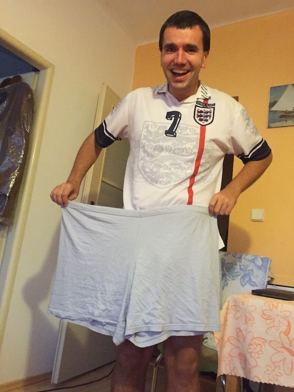
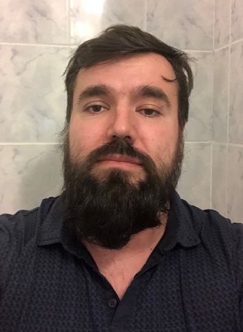
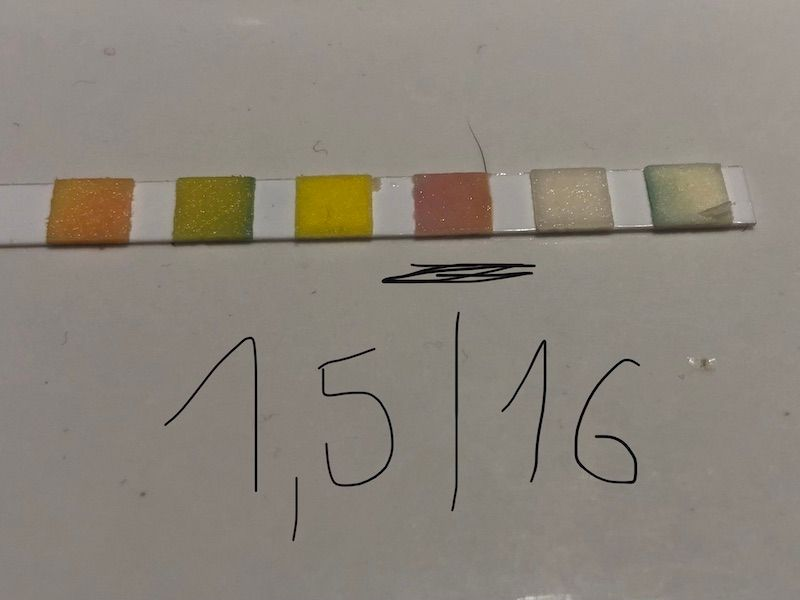
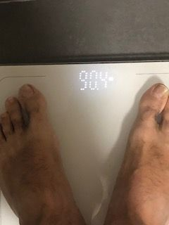
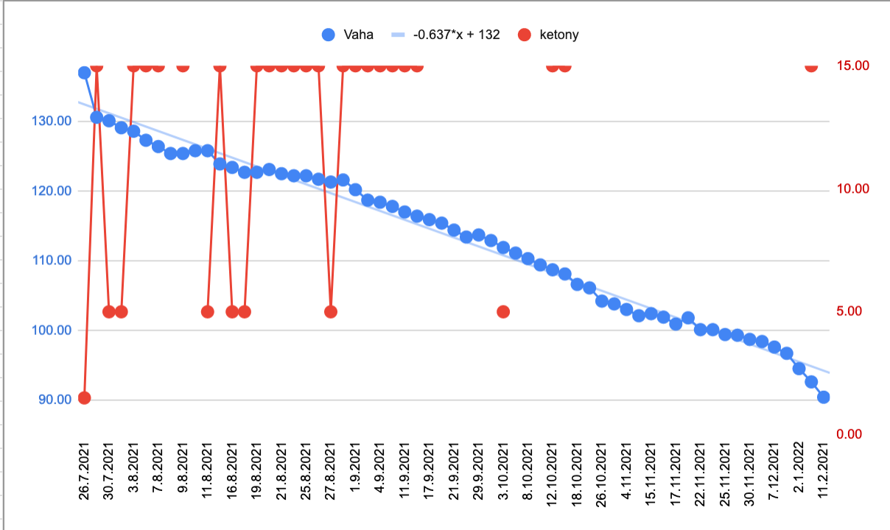
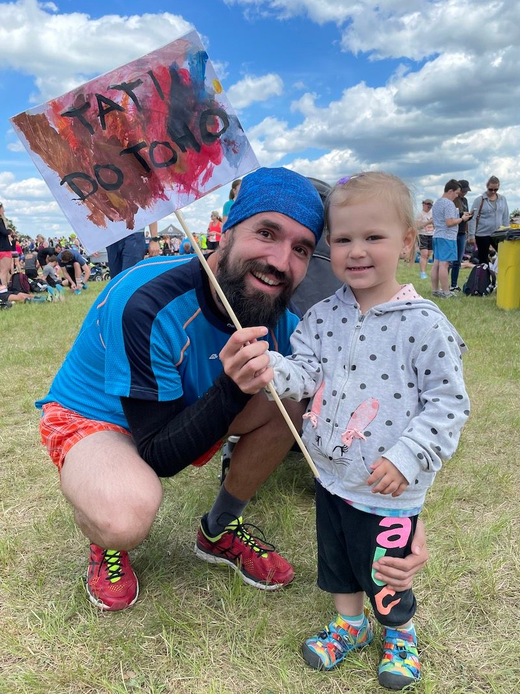

I was chubby all my life. Long time ago, I accepted it as part of my identity. I was unable to loose weight even when exercising and spending most of my free time outside chasing ball. All my years at school I was overweight and unable to buy nice clothes as I was out of confection size. But this is not story about how hard it was then. You can image ... I was target to bullies, xenophobia, point fingering and minimal support from family as my father wanted slim, football son that I could never be.  No, this is story about how I get out of obesity, about pitfalls and how to finally loose 50kg of weight and manage to **stay** on same weight for years. This story can be very beneficial for you if you want to loose weight or you know somebody in your family or friends who struggles with weight or you are just curious. Either way  my journey persuaded me that maintenance of stable weight is topic for everybody. Obesity, type 2 diabetes is so prevalent, that soon or later it will happen to you that your doctor will tell you, you need to lose weight as you are on a good way to die on CVD - heart attack. (If not, you will be one of few, genetically lucky ones)

The same happened to me years ago when I have visited my practitioner. I was obese, single programmer spending too much time at work, sitting on chair, drinking energy drinks, eating snacks, liters of coffee with milk. I was workaholic. I spent nearly all my day at work coding or browsing internet how to do my job better. I was true greenhorn, looking for the best design patterns and silver bullets. I always loved to be praised by my senior colleagues for great work. I was the great material to burn out. And surely I did.

I come to revelation at one long night when I was working on side project at home. At that period of time I managed to work all day at work, then at night walk back home and work whole night through for hobby project. I was eating my late second dinner after midnight. Thinking non-stop requires calories and sure I was binging a lot... One such evening I was sitting behind table and looked down to my belly. I could see just obese body and I start wondering how I end-up here. I was always chubby but not obese. Somehow I decided at that moment that problem with weight is an actual problem.

So I started with gold standard "eat less and move more strategy". I have picked swimming for 1h. I was too obese to do anything else. I started swimming every second day. Determination was never my problem, fighting with bullies at school made me pretty resilient and strong minded. If I consider problem a problem I would try always my best. With such frequent exercise, one day morning my trousers just fall of me and I spotted my first visible change.

With couple kilos down I could finally start doing other sports that I was used to do. I started with running. I never liked sprints but I like endurance sports.  I started slowly 3km, 4km, and end-up with regular 8 km run after few months. I also continued with swimming. It was actually very powerful combo and it started to be very, VERY visible.

<figure>
  
  <figcaption>
    My old pajama pants end-up as floor rag.
  </figcaption>
</figure>

I end-up to be in best physical form of my life. Actually regular sport decreased number of night hacking shifts as my motivation changed and therefore my sleep improved a lot. I started to be very energetic. I loose craving for sugar, for energy drinks and liters of coffee.  It pumped my motivation and I started joining organized runs. I started to have a problem with clothes. I went from tight XXL to very comfortable L.  I got feeling that I am back ..., finally.

If we end-up here it would be only half of story and it would look like a clickbait. Life is more complicated than news headings. I learned that hard way ...

> Losing weight is easy, weight maintain is the true art. 

My weight roller coaster started simple I got in love ❤...

There is nothing unusual with getting in love other than your priorities will change. And exactly that happened to me. My spartan life ended. I started solving other more urgent matters. There was always something more important than simply get outside running. I wanted to spend as much time with my wife so I could do casual thinks like watch films, dinner together, visit family members, feasts. We moved to new location and started living together. In time we got two wonderful kids. My regular sporting habits land in ruins. Though I did not stop it completely. I attend swimming in local swimming pool and started running in nearby hills. But it was very rare compared to nearly daily sporting before and I was getting more chubby again. I thought and I still think it was a good compromise. We got newborn babies and it takes two adult people handle them. I needed to tandem this ride with my wife. That is what dads do.

The coffin in nail was COVID-19 and lock down.  I stayed at home-office for many months and my weight was rock-climbing, again. May weight was once again over 130kg, my trick with swimming was not possible as everything was closed and I was too heavy for running. I tried to exercise yoga with my wife but I was so obese that I could not hold that habit.  Yoga for obese is actually hard.

Later I had to pick my old oversized clothes from old box and put my lean shirts back into box with groan that one day I will take them back. I was depressed, I was feeling as a complete failure... I knew I need to loose weight, change something but at that time I did not know where to start. As many obese people like me I was clueless. I got determination to change, as I am fighter from childhood but I felt so powerless.

<figure>
  
  <figcaption>
    me, over 130kg.
  </figcaption>
</figure>

Then happened something totally unexpected ... I got lucky in my life.

Youtube news feed algorithm showed me a video showing American doctor Dr. Pradip Jamnadas doing lecture about intermittent fasting and ketogenic diet. In nutshell his advice was eat once a day diet specifically triggering your ketone bodies, low-carb diet. It should help you to decrease weight just changing what you eat. For sure he was quack, I thought. Nevertheless he said you can easily measure ketones in your morning urine, just buy urine strip in pharmacy. So I gave it a try. I bought strip and ate once a day (a confit duck for starter :)). Next morning I sampled urine and I could measure a decent amount ketones.

<figure>
  
  <figcaption>
    decent number of ketone bodies in my urine measured at first day of diet by an urine strip.
  </figcaption>
</figure>

It worked ! I was so amazed with this small success. It gave me a kick to continue eating once a day for next months. And I did not know how deep was this rabbit hole and where it would end-up. I continued to fast for next 7 month and I lost 50 kg without any heavy workout, without going to jim (closed because of pandemic), mostly sitting in chair  at home office, working in garden and loosing weight. It fit what I could do during covid and it worked perfectly.

<figure>
  
  <figcaption>
    from 138kg back to 90kg after 7 month of fasting
  </figcaption>
</figure>

....

Is there any continuation to this ? Actually .... there is

I was so amazed how this is possible that I spent all of my time during covid chasing down this rabbit hole. My wife also joined researching along the way. She is a MD and she was also surprised. Actually nutrition was not a subject in MD curriculum at her time attending university. We read scientific papers and learn ton more. Most of papers is current research and there is so much more science in fasting then just getting hungry. One of effects is that your body will decrease secretion of ghrelin and neuropeptide Y that leads to less hunger, less cravings, less calories in. Second is that during ketogenic diet insulin level drops to levels where your body start to prefer burning fat over everything else. Low insulin spikes inhibits cravings for food. Very convenient when you want to effectively loose 50kg!

<figure>
  
  <figcaption>
    Blue dots - my weight. Caloric restriction (eats once a day, fully) and ketogenic diet did a trick. Red dots - ketone bodies. I sampled data nearly every day.
  </figcaption>
</figure>

To the other hand standard western diet is full of carbs. Carbs are added nearly everywhere. If you do not take a look to every package label you can be surprised how much added sugar you would get in. How much calories is in chips and nuts. You will burn them out if you train often, but expect yoyo effect when you stop.

Same happened to me years ago. I was unprepared and unaware of many details regarding nutrition. What are calories? Is there any difference in metabolism of sugars, fats and proteins? Can food program your genes to boost lipogenesis in a liver ? What exactly happens in your body after you eat ? How to build your schedule so you can maintain weight for long time ? How to setup your mind to resists obesogenic environment we live in ? How to loose weight effectively - so you can actually maintain weight for years ? The answer is more deep than missing knowledge in biochemistry. It is also social problem. It is very hard to resist food. Food advertisement is everywhere. We are also used to calm our stress with food. All this can lead to vicious circle "in stress -> binging -> be in stress from binging -> more binging".

With my wife we realized that answers to how to manage weight effectively is a great content to share. Good things must spread... We started a Youtube channel - [Metabolicky ridicak](https://www.youtube.com/@metabolickyridicak) (only in Czech) with content we learned about dieting. We see many people around us suffering with diabetes, obesity, high cholesterol. With no good way how to actually start. What food can they actually cook. What is needed for effective fasting? Channel contains short videos with quick recipes. Deep dive videos to bring important details from metabolism, reviews of diets (that we tested)  to kick start dieting and our own pitfalls that can help persuade viewers that "problem is a problem that should be targeted effectively".

> All materials/videos are open and free, as open source / open science. As it should be ...  

There is already fruit coming back to us. My pre-diabetic mom already lost 14 kg. She was able to change her diet even though she is conservative to food. She did it gradually and found the diet working for her. And not opposite - working for diet. Now she even find a time for regular exercise !

My journey persuades me that even our biggest weakness can be turned to advantage. Yeah, it can take some time and pitfalls and looping in circles but that is normal. We are just people. There is no silver bullet diet and all "good advice" needs to modified to particular context. To every ones preference, lifestyle and limits. Only then it will be effective. When short term diet will turn to long term habit.

All best to who ever starts weight loss endeavor ....

My journey continues ... ⛵

Peter

<figure>
  
  <figcaption>
    I am back! and running ! With my daughter Elis
  </figcaption>
</figure>
