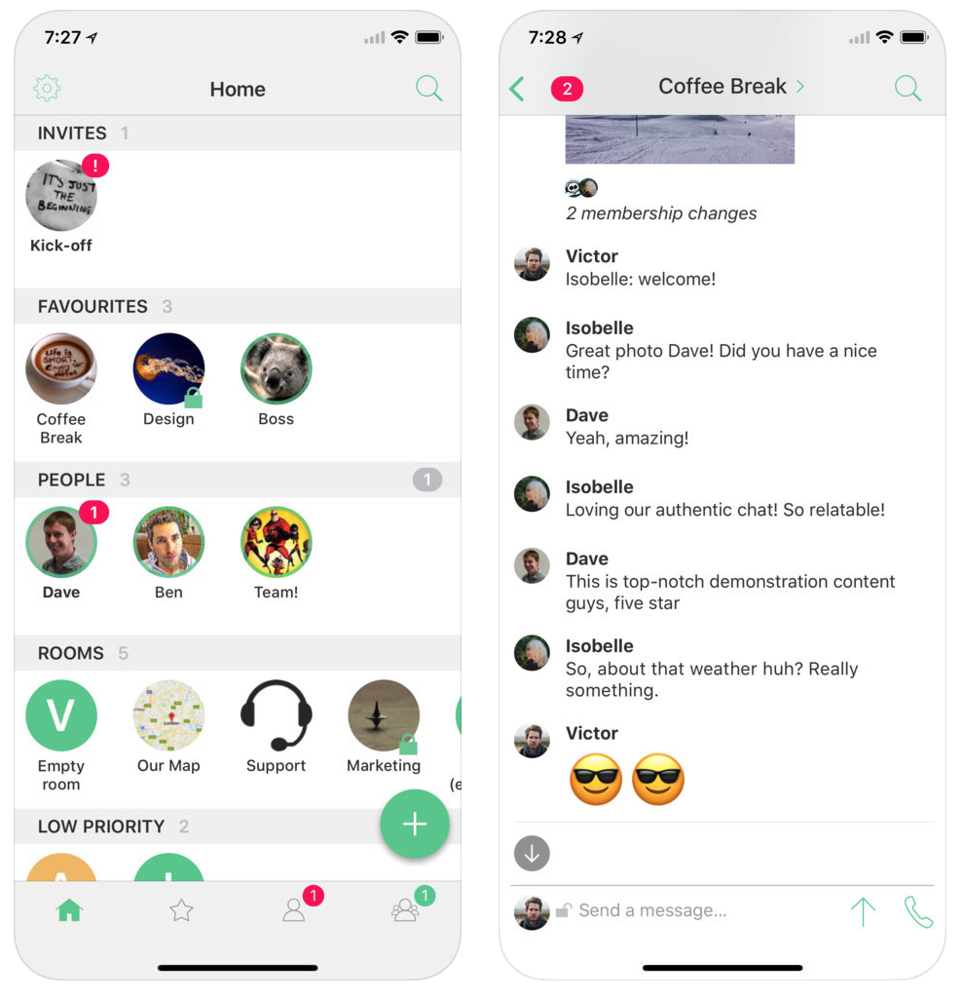

> TLTR; I had deleted my Facebook account. Ciao.

Not much more to add. I asked for an account delete. I had my reasons. Facebook provides amazing service but it comes with a price. And the cost is your privacy. With your first log-in every photo is analyzed. Every message is read by an A.I. and even every your move outside Facebook is tracked. That all together is the new currency of 21st century. Your behavior, opinion on matter, your plans and desires. Thats what we used to call privacy. Currently privacy is ignored. Its is considered as obsolete relict and also hardly to be exploited. It is not visible, so easily ignored. But it is so important! Over 90 % of our time we act according to feelings.

Did you ever wonder why ads on web-pages can be so precise ? You are tracked. Did you realised that prices on Amazon are different for you and different for your friends? Sales uses psychological profile to determine margin and price per customer. Even in president elections. Trump used psychological profiles of USA citizens in his last campaign. Pro-Brexit party used psychological profiles to win referendum in GB. Read more about Cambridge Analytica if interested.

Currently new regulations about data privacy GDPR is enforced and I welcome it because this field needs it. I consider this regulation of protection of your data. Nobody cared until now. IT field is not mature as other branches of business. Not many regulations, so it can take advantage of its full potential. But for my opinion it took too much. It made privacy obsolete. I do not expect to be my letters opened when I send them through PPL or DHL. They do not open packages and scan them so they can sell those informations to third party partners. Do you care if they open packages? If yes, why do you not care about Facebook also. I leave this question unanswered and let readers to decide by themselves.

> My mind is clear in this matter. I have decided to leave Facebook due to its "no privacy" policy. Privacy matters !

But I do not wish to cut off my contacts. So I decided to host my own chat service where I gradually ported my family members and all important contacts.
I wanted to share here details "why, what and how" I did it.
Why

My "Facexit" idea started a few months ago. I had my "the last nail in the coffin" moment when I read about Cambridge Analytica.

> Propaganda works best, when you do not know its source. Facebook delivered what propagandists have always wanted, a complete blurring of the line between editorial and advertising, often delivered with the added reliability of having been “shared” by a “friend”. [1](https://www.theguardian.com/technology/2018/mar/24/facebook-week-of-shame-data-breach-observer-revelations-zuckerberg-silence)

> ... figuring out whether a particular voter was, say, a neurotic introvert, a religious extrovert, a fair-minded liberal or a fan of the occult. Those were among the psychological traits the firm claimed would provide a uniquely powerful means of designing political messages. [2](https://www.nytimes.com/2018/03/17/us/politics/cambridge-analytica-trump-campaign.html)

What I consider as fundamentally broken is the monopol

* your identity is Facebook identity - you can have only a single account and communicate only with other Facebook accounts, You do not like Facebook policy, you can still leave, but you will leave also all your contacts.
* information sources - your wall is build by Facebook alghorithm. You can pick and choose your activities, follow groups but you do not have much choice how much "other content" - adds, propaganda, fake-news you will see. Building personal source of information I consider one of my basic rights to be well informed. I spend a lot of time to find proper sources. You can leave Facebook, but once again, you will loose your information sources.


> Is a choice from one option still a choice ?

This is a fundamental question. Do you want to leave inside a golden cage with a golden path inside or not ? Do you want to embrace the truth or leave in a fable. I do not expect that everybody bothers, I do not expect to those who bothers will react eventually. But I want to give to those who are willing to listen all what I have learned on my way and let them choose. To give them more options then one.

My job is to work with data, I work with algorithms that analyze you, make predictions about you and bring benefits to life of everybody. I am familiar with what it really takes to act. I can help in this case. So why shouldn't I ?


## What next ...

I have started this project some months ago where I was looking for more proper alternative to Facebook. My requirements were (all must):

* simple - app has to be simple and comfortable to be used by my friends and family. My mama has to feel comfortable using it, otherway no point to switch if nobody wants to message you ;-)
* messaging - be able to send simple messages, images, video
* video conferencing - support for video calls.
* ssl - support SSL everywhere and end-to-end encryption
* self hosted - data has to be stored on my servers. Otherway there is no point to switch from Facebook. You make your communication private again by storing history outside internet vendors. I want to store it securely on my own servers.

I have looked to multiple projects (ejabberd, rocket, ...) and was unable to deliver all requirements until I have found project matrix. What really strikes me on the first sight, it is not a client or server but protocol specification. And in its core it is federated protocol. Then I realised that this is what actually solves problem with monopol. Idea of federation is simple and resembles email. You may have an email account at gmail but you can still communicate with other people in different networks, like yahoo, aol, seznam, your company , because your identity is not owned by particular network but can be shared between them. If you want to switch from your email vendor, you create another account. You do not loose your contancts. You just send them your new email address. It is simple.

Matrix is a similar concept. It also have user address - chat address. In my case it is:

> @peter:petercipov.com

It has domain part (petercipov.com) and user identifier (@peter) as you have in email. So when you want to contact someone you need his chat address. Simple.

Matrix is federated protocol. Same as email. You can use vendor hosting (f.e. matrix.org provides free chat hosting) or you can host it by yourself as I do.

Your data is stored on homeserver and when you wish to contact somebody on different homeserver a copy of a message is transfered. Again same semantics as email.

You can make voice & video calls. Matrix supports WebRTC. It is possible to call to different device or even to web browser.

Matrix natively support end-to-end encryption[1, 2] It can be setup per room. When enabled, messages are encrypted on client, before they are sent to server and that way they are visible only to recipients.

Matrix is a protocol. It provides back-end reference implementation written in python and already there exists multiple front-ends, from those I like the most Riot.im that can be installed nativelly on iOS and Android or used as electron based desktop app or as standalone single-page web app.

<figure>
  
  <figcaption>
    Element.IO user interface.
  </figcaption>
</figure>


## How
So I have decided to host chat service myself. My use case is purelly personal. I do not want to host it for money (aka I pay the bills :)), I do not process any data (whole purpose of this project). First step was to study GDPR. I have read GDPR regulation to find what requirements I need to fulfill. I was happy to find following [1](https://gdpr-info.eu/art-2-gdpr/) ...

> This Regulation does not apply to the processing of personal data: ... by a natural person in the course of a purely personal or household activity;

100% comply :)

Even more guys from matrix takes this regulations seriously and will provide patches to make matrix complement with GDPR [2](https://matrix.org/blog/2018/05/08/gdpr-compliance-in-matrix/). So for commercial purpose it will be delivered in next few patches.

## Self Hosting

For my purposes I want to have everything simple and minimal. So cost/value ratio would be in my favour. I have bought two small 1GB RAM VPS (virtual private services). 1 for hosting of homeserver and one for hosting STUN/ TURN server userd for Voip and Video calls. Also domain DNS record is required. One for matrix homeserver chat.petercipov.com and one for STUN/TURN server turn.petercipov.com. Actually TURN server is pretty heavy on traffic and resources therefore 2 VPS.

I use latest debian on all instances and using public/private keys to access. No passwords. All proceses I use are dockerized.

* https://hub.docker.com/r/petercipov/synapse-docker/tags/ for synapse homeservers
* https://hub.docker.com/r/petercipov/coturn-docker/ for STUN/TURN server
* https://hub.docker.com/r/_/postgres/ (alpine version) as data storage

Actually you can use official synapse docker image with everything wrapped inside, but I prefer to use separate process and potentially scale and reshuffle instances by myself. Nevertheless all in one package is much easier to start with.

Files and images are stored directly on file system. I have setup size monitoring, so when they reach max limit I will backup/purge them. It is possible to use different options but for my purposes it is far from its limits.

SSL is handle by lets encrypt and cerbot docker image.
```bash 
docker run \
  -v `pwd`/data/ssl:/etc/letsencrypt \
  -e distinct=true \
  -e domains="domains....." \
  -e email="email...." \
  -p 80:80 \
  -p 443:443 \
  --rm pierreprinetti/certbot:latest
```

## Conclusion

Do not be fooled by falacy of free services.

The whole point with privacy, is about ownership and control. It is an asset as your finances, houses, flats. You can hire finance advisor to help you, you can rent house. But you can also say no and terminate it. Before GDPR you did not have much choice with control over your privacy. You were dragged to this bussinees even thou you did not want to. By pressing "allow access to your mobile contacts" you send all data of your friends and precreate hidden accounts for them, even for those who does not have one.

I consider GDPR a positive step towards giving us more power over privacy. If you sell it, your choice. In matter of privacy I rather play cautious and build my own game rules and shape my life as I like it. And yes it is a lot of extra work, but believe me it is worthy.