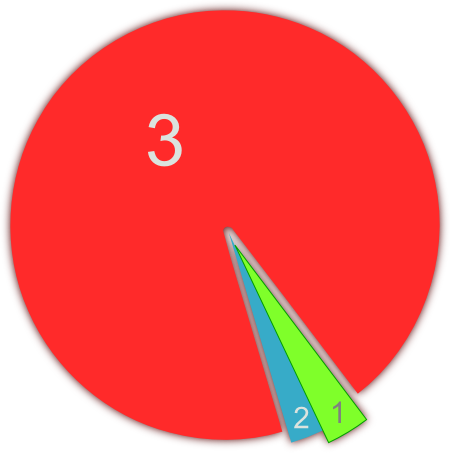

One of many things that I had to learn when I graduated from college was to make things done. I do not say that I have not successful projects before but I spent lot of time to search the best way.

I had a habit to figure out what technology to use before I have my use-cases. It is kind of habit of programmers that they like to do make their own frameworks for the things they do. They glue some set of classes and they are eager to use them everywhere.

They tend to use other frameworks that are popular in community. Actually they use tons of them. It is nothing bad until you can clearly answer what problem they solve, what are the positives and what slows you down. Without these answers it is only blind religion and then comes inevitably time when you will bend your code for purposes of framework limitations.

> In the end, maybe you do not need those sexy frameworks.

I had other assignment. I had to write set of diagrams to present dependencies and structure of new protocol I was implementing. I have spent a lot of time to find best tool for drawing diagrams and I did not make it in time. Then I realise I do not need it at all. I just need my whiteboard and markers and do the job fast and dirty. Then I used Inkscape for fast sketch. The task was done in a few hours instead of days.

> Do not try to figure out the best way because you do not see the whole picture. Just try to solve your problem.

A things you know

1. things you know
2. things you know that you don't know
3. things you don't know that you don't know

<figure>
  
  <figcaption>
    This picture displays normal order of knowledge we possess.
  </figcaption>
</figure>

Do not try to figure out the future. We are bad at this. Focus what is here, what is now. Base your actions on actual metrics and make decision based on them. Reasoning with "It is good to", "I think", "I hope" is a bad practise. You can easily stuck in blind corner of programming religion without creating any business value. Lets face it, business value is what actually generates money that we earn.
