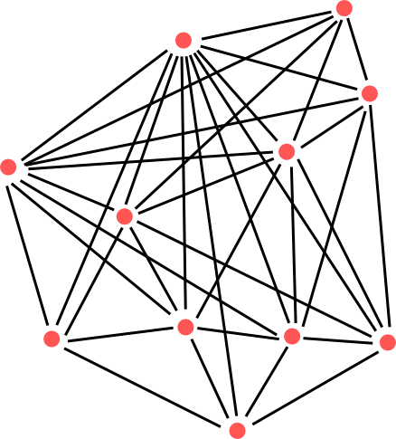
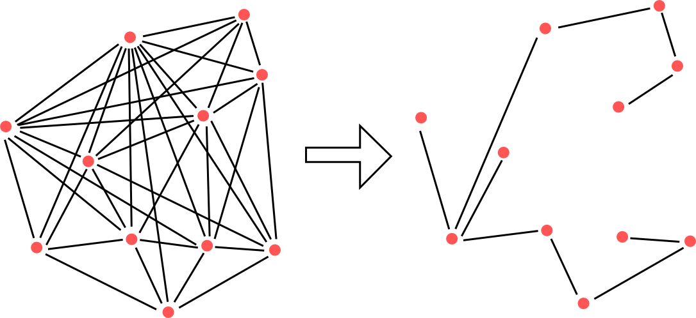

Micro-services is buzzword of today. It is the new best, something you should definitely implement. No! Never believe in such fancy statement. Engineering is never sunshine and roses. You should be able to reason about problems and choose best for you eventhough it is not popular at the moment.

What is the monolith ? According to [dictionary](http://www.oxforddictionaries.com/definition/english/monolith) is a statue build from single peace of stone. In our case we can imagine a classic type of application written in a single language, stored in single repository, executed in a single process, using single database, with single view model.
Most monoliths have in common

* coupled features - one feature cannot exists without other
* spaghetti code - there are no clear boundaries, code is fuzzy, illogical, full of weird names like Provider, Factory, Manager, Abstract, Executor.
* global mutable shared state is a superstar.
* no decomposition

These are not really disadvantages of monolith, but these situations are just very common, because it is so easy to do them. And when deadlines are near it is almost a rule to bend something, to adjust something, just to make it work !

<figure>
  
  <figcaption>
    Example of the monolith.
  </figcaption>
</figure>

We can imagine monolith as a graph where nodes are functions, classes, libraries, packages, data storages, tables and edges are the dependencies between them. This image is an example of coupled monolith, it is nearly full graph, where everything depends on everything. This is a typical nightmare when you obtain code after your colleague, you are not even able to understand such a beast :) and this one was maintained for decades. I have seen projects where it took months for developers just to read over codebase and understand what it does. I do not need to tell you how much joy brings such work.

What will happen when your project starts to grow? Number of nodes and edges will also grow. Such project requires more man power and so you hire more people and now there are multiple of you that can change something. Just to change public interface of single node you will have to repair all of its dependencies and situations becomes even worse when change will "bubble" to multiple level of the graph. Changing something is nightmare and even worse in time the graph will grow so does the complexity.

Doing optimisation is sometimes impossible. Lets imagine you have single table where you store structure and data. Structure is for example tree structure where every table row has a pointer to its parent and one huge blob of data. Write optimal SQL for such table is nearly impossible. It really does not matter what kind of database storage you use. You want structure be cached in RAM, but big blobs flush it and make it less effective. What you really need it is divide structure and data and optimise storages just for them.

To be honest, to the other hand monolith is so easy to start with that it is almost no-brainer for small projects in their early stages. In this state you do not even know what your project will look like. Leave micro-services for later and focus on business value instead.

> If you don’t end up regretting your early technology decisions, you probably over engineered……Re-architecting is a sign of success; if you never need to, either you overbuilt or nobody cares. (Randy Shoup)

Lots of projects starts as monoliths and monoliths is just fine for them for very long time. But then comes a time when new features requires something that monolith is not able to provide without hacks. For many cloud services it is hight availability. In simple words you cannot just shutdown your service, upgrade all binaries, run upgrade of the database over night and pray so at the morning everything will work. You have to chop monolith to set of services and upgrade them separately, so when you shut down something you shut down partially or in better case you just degrade responsiveness. Upgrade can be managed and that is the core idea. You are in control which part is upgraded and you choose proper steps and order in which they are applied.

```
eBay
Monolith in Perl   -> Monolit v C++ -> Java    -> microservices

Twitter
Monolith in Rails  -> JS / Rails / Scala       -> microservices

Amazon
Monolith in C++    -> Perl/C++   -> Java/Scala -> microservices
```


All internet giants are now running clusters of micro-services. They have started as monoliths. They were written mostly in a language that was favourite one of company founder. In time, monoliths were rewritten to better structured monoliths and finally chopped to ecosystems of micro-services. What become important was the possibility for services to communicate easily. This was the reason for creation of protocol Facebook Thrift, Google Protobuff and REST. Services written Python can easily communicate with services written in Java or C.

<figure>
  
  <figcaption>
    Example of the monolith chopping.
  </figcaption>
</figure>


The solution to problems with monolith is quite trivial. Chop it to services and manage them with version control system. Just like we are used to with maven, osgi, npm, the same approach was reused for micro-services (here comes handy docker and its image versioning).
Every micro-service is responsible for single function, for its data and upgrades. Micro-service does just one thing( just for registration, just login, just authorisation or just comments). What you will see in time is gradual chopping. You start with single service and gradually you chop. You can chop literally till you drop. :)

Top-down design is the rule of thumb when you do so. You start from your requirements and divide them to smaller parts until you provide optimal solution for them. The technology stack should be the last thing you choose. If you need nosql storage fine use it. If mysql is enough fine use it. But do not do it in reverse order, I have mysql and php, drupal and how would I write that feature in it ? You are adding restrictions over yourself and making your task more harder than it needs to be.

I have seen overkill solution for famous java EE perm-gen exception - Java EE containers will eventually crash when you deploy WAR files multiple times, because loaded jars and classes are not garbage collected. The proposed solution will look to your WAR file, process classes and suggests how to bent your code to actually to prevent it. It seems useful. But do you really need WAR deployment ? Do you need full container ? If not, what about embedding container in your code ? Run simple Main class that starts containers in embedded mode. From this moment you have no problems with perm gens!

> The simplest solution to any problem is ... do not create problem at first

If it is problematic for you to properly structure monolith, micro-services will be hell.

Looking for the reason why something fails on distributed production system is hell. You do not have single process that can be broken, but you have dozens or hundreds of them.

Therefore writing micro-services without tests on every level is no go. Cover your code with unit tests and gradually write integration tests. You will soon realise why coding without them is bad idea. It will take you days to actually find out why something does not work !

The approach of micro-services is the optimisation. The rule of thumb for optimisation - do not optimise if you do not need to - also applies for micro-services. Do not use them blindly. They can help a lot but they can be nightmare if they are done badly.

Ps. I am looking for stupid discussion that will arise in time: micro-services are dead, long live monolith. The same fallacy I have seen with tdd is dead. The disappointment of developers that actually did not understand topic well enough to find out that nothing is silver bullet and everything has its good and week parts.