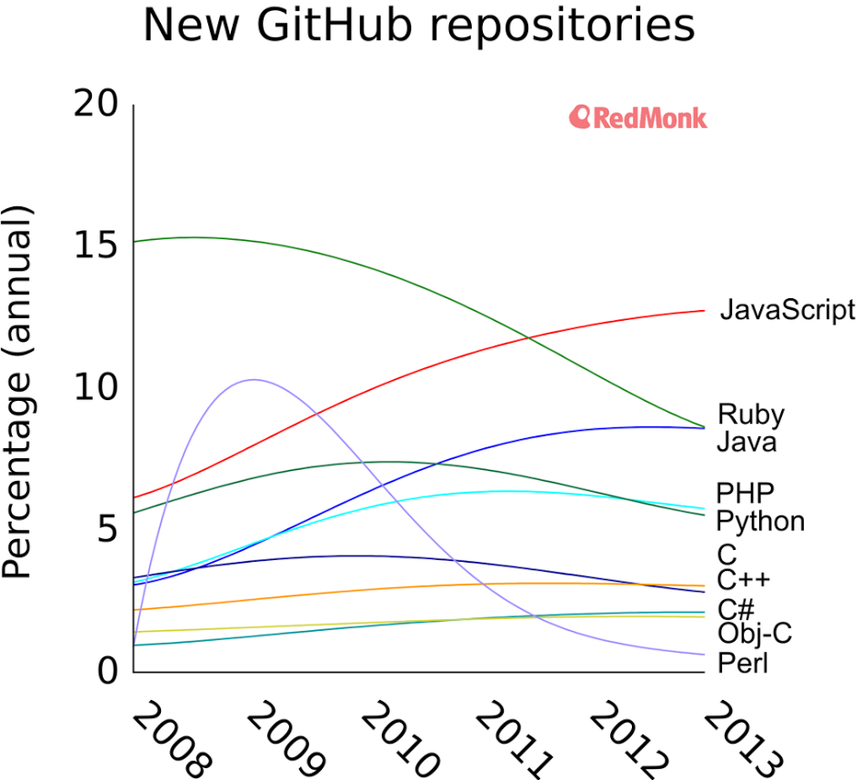

What is the best programming language? I have spent many hours in this endless debate and the conclusion was that for many programmers it is matter of taste.

Today the sexiest language is JavaScript & Node.js platform. Tons of new project are popping up like a fresh breeze. The new zeitgeist is "all in JavaScript". It is easy, it is fast and event-loop will redeem your project. You write your client/server code in a single language. So from now you just need JavaScript coders.

<figure>
  
  <figcaption>
    Github repositories language chart.
  </figcaption>
</figure>

Really? It is really matter of taste? Of course not. Programming language should always be matter of your current circumstances, workload you are solving.

If you want to scale, It is a bad idea to write database drivers purely in JavaScript. Think first about garbage objects that this will produce. At low scale it is ok but soon you will reach technology limit. Then you can choose whether to buy new machine or optimize your code. It is not obvious choice. You can use well written low level driver written in C. You will wrap it with JavaScript and create npm package. Everything seems fine again until bugs pop out and you cannot debug to linked C library from JavaScript. Your programmer is speechless and he want you to find someone that fixes it. You can hire some C freak or you can just buy new and new machine. Sometimes new machine is quite enough, sometimes TCO (total cost of ownership) is bigger.

Write your code once - client and server in a single source base. It is a myth. I have written in Javascript for a few years and there were numerous cases when IE sucked, when Firefox had some bug, when Chrome went crazy. On the other hand you want to support the widest range of browsers, so you have to ify (add if) your code. You have multiple bent places here and there to overcome that or other browser weak part - it is better not to share this. Maybe in future this will be fixed but now this sucks.

Wheel of reinvention - Using JavaScript everywhere is trend. It may seem that they solve a new set of problems. They do not. For example sockets are known from beginning of network communication, but in JavaScript it is a new HTML 5 addition with new name WebSockets. In fact JavaScript greatly solves just a single problem and this is application distribution. No complicated installation, but you can bring similar user experience as native apps with one click. Therefore browsers are becoming minimalistic, chrome is just a single toolbar, so there is more place for your application.

Javascript is oure evil - This is also common opinion. JavaScript is slow. You have to download MB of javascript to render DOM. You should instead render html on server. On the other hand there are multiple reasons why you do not want to do this. When you divide presentation layer from server business logic you can develop both sides separately. You specify API between them f.e. via apiari.io and then you can develop in parallel. Second reason is even more important. You can make your applications rich. It is not set of isolated pages anymore. With HTML 5 JavaScript you can create hell of user experience. This is a paradigm shift. Internet connection is fast so you can transfer MB of JavaScript to your single page app. You often do this only once and then internal cache of browser will return stored code without download from server. Javascript is very poweful tool, but if you give knife to small child, he will cut himself.

Always think about your problem first. What are your cases? Will language X solve some of them? It should not be matter of personal prefferences, feelings. I think ..., I hope ... are often signs of assumtions and bias. you should avoid it in your project. You can easily find someone with different opinion in your team. Endless debates will make you tired without any gain of business value. You loose time and money. Software is risky business. Can you afford to burn your opportuninties instead of delivering value ?

> There is no best programming language. There is optimal language for your job.
