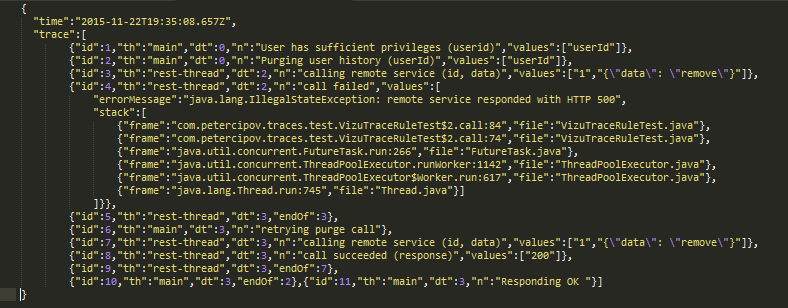
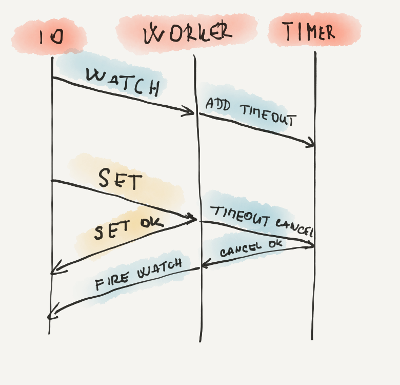
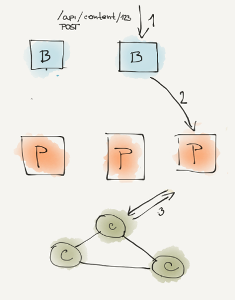

One problem you can encounter when you are making distributed system is how to log properly. To be more precise, how to make your logs useful ? In case of simple application shown on every tutorial blog, logs are not mentioned, or skipped. But on the other hand they are irreplaceable when you want to figure out why is your system failing. As my colleague often speaks:

> There is never enough of logging.

There are tons of frameworks to help you with it (slf4j, log4j, …) but in my opinion they deliver only half of the solution. Systems in bigger scale tends to have lots of logging messages. But you also have multiple machines with multiple services, all this messages are written to one giant file (or to set of giant files) and your task is somehow to find a needle in it. It is trivial task but with bigger and bigger log files it takes more and more time. One would save a lot of trouble if all messages that are bound together could be easily retrieved from files. And that is the essence of tracing. You mark somehow long messages together and give them order by occurrence. For example you can group messages by request. All messages about database communication, your service logic messages, like ACL, custom business logic, all in a single sequence of log messages ordered by occurrence in a history. It would be really handy if logs would look like this:

* API request started (path: /api/user, scope:all )
* Authorising session (session id: hgty7)
* Authorisation granted for reading
* User service is loading users
* Users loaded from database (count:452)
* Transforming to JSON
* Response sent successfully

You can trace message, parameters and exceptions. When you log them separately they have less meaning opposite to when they are presented together. You have to process logs to actually obtain this kind of value and often it takes enormous amount of time. Sometimes you do not have even enough information in logs to group messages reliably. It is often a case in asynchronous programming, where request is not processed by single thread so it does not have single stack trace. Request is divided to sequence of sub-tasks that are executed in order but we cannot say anything about their actual execution time, because they are planed by system scheduler, therefore non-deterministic. You have to add additional information to message log, some kind of id, to be sure. This way you are making custom traces.


## What is wrong with logging ?
The core problem with logging is the loss of information and context. In the program you have full context. You know where you are, what are your inputs, what are the next steps. You log it to file in some text format. Often you do not log there all context information, because you do not think it is important. Sometimes cause of failure is a single exception from database or null pointer. Then logging single message is sufficient, but what about semantic errors, when bug is hidden in complicated flow of messages between your services? In case of distributed systems you can encounter a different kinds of failures f.e. networks floods. Then it would be handy to know what was the cause. It could be also error or some glitch in code semantics. Those kind of errors are nearly impossible to reproduce. And it is almost too late to add more logging when they occur - your system is crumbling and you should react as soon as possible.

Your logs are stored somewhere. It may be kibana, graylog, …. Those systems provide very limited searching - no joins in searches as we are used from SQL database, because such searches are not scalable. We should store already aggregated data in such systems where single message input is the aggregation of messages from single request or configuration change or system start-up or tear-down. These aggregations are custom to every project even though they share some similarities.

It is handy to log everything. all input parameters (if they are reasonably small, or their sizes or their ids), all computation steps in business logic, all its results, and all its output actions (sending message or responding to request). All of this information is then serialized to text format and stored in logging system.

## Example

Lets start with single node example. Call remote API that purges user history. Here is pseudo-code

```java
public int purgeHistory(Trace trace, String userId) {  
  checkACL(trace, userId);
  purgeUserHistory(trace, userId);
  return respondOK(trace);
}
```

To purge users history, users access rights are checked, then history is purged and success response is sent back.

```java
private void purgeUserHistory(Trace trace, String userId) {  
    Event purgingEvent = trace.start("Purging user history (userId)", userId);
     try {
      callRestService(trace, 1, "{\"data\": \"remove\"}", true);
    } catch (Exception ex) {
      trace.event("retrying purge call");
      .....
    }
     purgingEvent.end();
}

private void checkACL(Trace trace, String userId) {  
    ....
    trace.event("User has sufficient privileges (userid)", userId);
}

private int respondOK(Trace trace) {  
    ....
    trace.event("Responding OK ");
    return 200;
}

private String callRestService(final Trace trace, final int id, final String data, final boolean fail) throws Exception {  
    Event callEvent = trace.start("calling remote service (id, data)", id, data);
    String code;
     try {
      if (fail) {
        code = "500";
        throw new IllegalStateException("HTTP 500"); 
      } else {
        code = "200";
      }
    trace.event("call succeeded (response)", code);
    } catch (RuntimeException ex ) {
      trace.event("call failed", ex);
      throw ex;
    } finally {
      callEvent.end();
    }
     return code;
}
```

The Trace interface is actually very simple code. It contains two methods. Start when you want to record some event that has the duration in history. Event is marked as finished when end method is called. The second method is used for simpler case when you want to record an event that has occurred at single point in time.

```java
public interface Trace {  
    interface Event {
        void end();
    }

    Event start(String name, Object ... values);
    void event(String name, Object ... values);
}
```

<figure>
  
  <figcaption>
    Example of the trace.
  </figcaption>
</figure>


Every action that was made in code was recorded. Every record has timestamp (dt - delta time, number of milliseconds from first event), id that is unique in trace and growing according to an execution order. It contains name of the thread (th) that has executed the code, message (n), values and exception stack traces. There some messages that refer to previous records (endOf) and they serve to note when method finished.


## Amount of data
On the one other hand it produces a hell of data. It is a feature of traces that you have mitigate and prepare your custom logic to resolve it.
In a case of high frequent calls you can sample logging and pass NOOPTrace instead of logging race, and log just some percentage of them. Even such portion of data can have actual value for you. You can look for calls with high spikes. Or you can log traces only in case of exception. You would loose real-time metrics about your system but even such trace would be more useful than simple stack-trace. It really depends what you need from traces.

## Not a new idea at all
This idea, is not new. I have not invented it. It is just handy and straightforward and I have great experience with them when I wanted to figure out "why it does not work". It is core idea behind google tracing system [Dapper](http://research.google.com/pubs/pub36356.html) and [Zipkin](https://github.com/twitter/zipkin) from Twitter. I have not used Zipkin because it is focused only on duration of method and I actually wanted to log some portion of data. When I was researching Zipkin it missed this important feature. In my best knowledge it does not have this feature today. Therefore I have created simple stupid library to do what I actually wanted. To the other hand Zipkin logging via scribe and processing via collectors is very sophisticated. I do not want to compete it. I think developers that created it have done a great job. But for my environment it was overkill.

In my case I have used tracing for application written with RxJava. Code was mostly written in functional style. Business logic are sequences of timers and waitings for responses from different services. It is highly asynchronous code. Before traces, when something had failed, it was nearly impossible to reason why. There was no complete flow, just stack trace from executor thread. And this is core idea, tracing is in some manner your custom stack with reasonable params, it just depends on you what is put inside and it is passed during whole execution of single request.

<figure>
  
  <figcaption>
    Example of the flow.
  </figcaption>
</figure>

In my case service had 3 threads. One for IO, one for all event logic and timer thread. Typical request would be watching some resource for change. Request is registered and than waits for change. Thread is not blocked but request is packed as task to timer executor with some timeout. After this timeout, request is recovered and "no change is returned". Otherwise when some modification happened meanwhile timer is canceled watch return "change occurred". I would like to somehow log this whole process. Why request was postponed why it was recovered, which request has done it.


## What is the difference?
My point is that I have written Traces in much simpler manner than the other solutions. I do not assume anything at front. It is as explicit as possible. It does not need any annotation, any thread locals any request contexts, any meta-programming, just no magic. This may seem in contradiction with common approach like aspect oriented programming, where you you write a set of selectors and code is somehow automatically instrumented. My argument is that any automation will not bring you satisfying result. You have to decide what is important to you at line level. Any automation will bring you next level of abstraction that you have to reason about and I argue that meta programming approach will be un-maintainable because code contains just too many edge cases and in time they have tendency to spread.

Why not to go with approach of slf4j where you have logger factory that is static accessible. i.e. globally? Then you do not need any extra parameter in your methods... Such approach is optimal for standard java code, where in all methods in a program are managed with the same thread. Therefore context is same. But in a case of switching between multiple threads you loose your context and what is even worse it can be "reused" with other request. You may argue that you can use some kind of token, but now you end up in same situation. You have to pass something to your methods to bind them together, why not just pass them trace object and you do not need any reflection magic and code does what is actually written in it.

There is a simple rule what to trace and what not. Trace something, that has the end in finite time, preferably in short time. Infinite algorithms would have infinite traces, and long lived tasks would have huge traces. You do not want flood your memory with something endless, don’t you ?

## Are traces distributed?
Simply yes and not :) You have to make them distributed.
<figure>
  
  <figcaption>
    Distributed trace.
  </figcaption>
</figure>

Lets have a simple example where you have balancer nodes(B), processing nodes (P) and Cassandra nodes (C). When request (1) arrives to this infrastructure it is routed by internal balancer logic and passed (2) to a processing node. Here it is processed again and call to Cassandra is executed(3) and than response returned back to client. To trace this calls you have to pass some kind of global trace id through layers so on each each node you log separate trace but marked with this global trace id so then afterwards you can just load all traces with the same global trace id. You generate this global trace id at the entry and than just pass it to subsequent layers. It is just same idea as passing trace objects via your code.

## Is it a "new blue" ?
Traces are not something new, it is just different approach of logging. The question is do you need them? When you have distributed system with complicated set of messages that are sent between services I recommend you to consider them. You would have to figure out what amount of data you can handle and modify your code. It is some amount of work, but again any automation and general solution with aspects may not bring satisfaction. Even I am not sometimes sure from the beginning what to trace but when code starts to behave strangely I add more traces. Now I am used to use them everywhere but it may not be your case. As always, there is no silver bullet. It is just a good aid when you are stuck with the same sets problems as I have.

You can find sources [here](https://github.com/petercipov/traces)